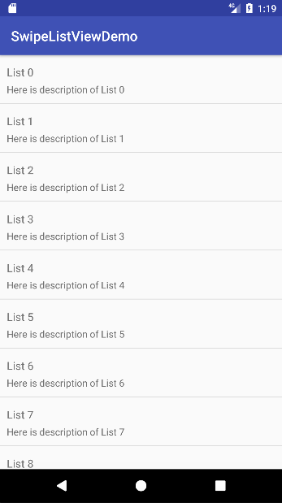

# SwipeListView
## 仿qq列表滑动效果，适应效果强，可进行自定义或动态调整抽屉内容，操作事件绑定简单。





### 使用说明
- 1、建立列表项Layout文件，基本要求如下（简单举例，详细参考Demo）
```html
<?xml version="1.0" encoding="utf-8"?>
<LinearLayout xmlns:android="http://schemas.android.com/apk/res/android"
    android:orientation="vertical" android:layout_width="match_parent"
    android:layout_height="match_parent">
    <com.zhangshirong.swipelistview.SwipeListViewScroll
        android:layout_width="match_parent"
        android:layout_height="wrap_content"
        >
        <LinearLayout
            android:clickable="true"
            android:orientation="horizontal"
            android:layout_width="match_parent"
            android:layout_height="wrap_content">
            <!--第一个是item主要显示的内容-->
            <LinearLayout
                android:orientation="vertical"
                android:padding="10dp"
                android:layout_width="match_parent"
                android:layout_height="wrap_content">
                <TextView
                    android:id="@+id/name"
                    android:text="Hello"
                    android:gravity="center_vertical"
                    android:height="30dp"
                    android:textSize="16dp"
                    android:layout_width="match_parent"
                    android:layout_height="wrap_content" />
                <TextView
                    android:id="@+id/desc"
                    android:text="Hello"
                    android:textSize="14dp"
                    android:gravity="center_vertical"
                    android:height="20dp"

                    android:layout_width="match_parent"
                    android:layout_height="wrap_content" />
            </LinearLayout>
            <!--按钮显示的内容-->
            <LinearLayout
                android:layout_width="wrap_content"
                android:orientation="horizontal"
                android:layout_height="match_parent">
                <Button
                    android:id="@+id/modify"
                    android:text="Modify"
                    android:layout_width="wrap_content"
                    android:layout_height="match_parent"/>
                <Button
                    android:id="@+id/delete"
                    android:text="Delete"
                    android:layout_width="wrap_content"
                    android:layout_height="match_parent"/>
            </LinearLayout>
        </LinearLayout>

    </com.zhangshirong.swipelistview.SwipeListViewScroll>
</LinearLayout>
```
- 2、在Activity Layout里使用SwipeListView
- 3、SwipeListView使用SetListener进行相关的Item事件和控制按钮事件的注册
```java
listView.setListener(new OnSwipeListItemClickListener() {
            @Override
            public void OnClick(View view, int index) {
                //item点击
            }
            @Override
            public boolean OnLongClick(View view, int index) {
                //item点击长按
            }
            @Override
            public void OnControlClick(int rid, View view, int index) {
                AlertDialog.Builder ab;
                switch (rid){
                    case R.id.modify:
                        //item点击modify
                        break;
                    case R.id.delete:
                        //item点击delete
                        break;
                }
            }
        },new int[]{R.id.modify,R.id.delete});//按钮view的id
```
- 4、设置ListAdapter（继承自SwipeListAdapter）具体使用如下（请参考案例）
```java
class ListAdapter extends com.zhangshirong.swipelistview.SwipeListAdapter {
        private ArrayList<Info> listData;
        public ListAdapter(ArrayList<Info> listData){
            this.listData= (ArrayList<Info>) listData.clone();
        }
        @Override
        public int getCount() {
            return listData.size();
        }
        @Override
        public Object getItem(int position) {
            return listData.get(position);
        }
        @Override
        public long getItemId(int position) {
            return position;
        }
        @Override
        public View getView(int position, View convertView, ViewGroup parent) {
            ViewHolder viewHolder = new ViewHolder();
            if(convertView == null){
                convertView = View.inflate(getBaseContext(),R.layout.style_list,null);
                viewHolder.name = (TextView) convertView.findViewById(R.id.name);
                viewHolder.desc = (TextView) convertView.findViewById(R.id.desc);
                viewHolder.modify = (Button) convertView.findViewById(R.id.modify);
                viewHolder.delete = (Button) convertView.findViewById(R.id.delete);
                convertView.setTag(viewHolder);
            }
            else{
                viewHolder = (ViewHolder) convertView.getTag();
            }
            viewHolder.name.setText(listData.get(position).name);
            viewHolder.desc.setText(listData.get(position).desc);
            //注意这里的使用
            return super.bindView(position, convertView);
        }
    }
```